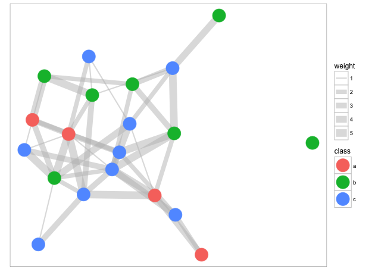

### ggraph
<https://github.com/thomasp85/ggraph>

ggraph is an extension of ggplot2 tailored at plotting graph-like data structures (graphs, networks, trees, hierarchies...).

```{r, message=FALSE,warning=FALSE, eval=FALSE}
# Example from https://github.com/thomasp85/ggraph
library(ggplot2)
library(ggraph)

# igraph
# We'll just make up some data
library(igraph)
gr <- erdos.renyi.game(n=20, p=0.2)
E(gr)$weight <- sample(1:5, gsize(gr), TRUE)
V(gr)$class <- sample(letters[1:3], gorder(gr), TRUE)

# Plotting this is exactly as plotting a dendrogram
# All igraph layouts are available - here we use Fructerman and Reingold
ggraph(graph = gr, layout = 'fr') + 
    geom_edge_link(aes(size = weight), color = 'grey', alpha = 0.5) + 
    geom_node_point(aes(color = class), size = 10) + 
    coord_fixed() + 
    ggforce::theme_no_axes()
```

