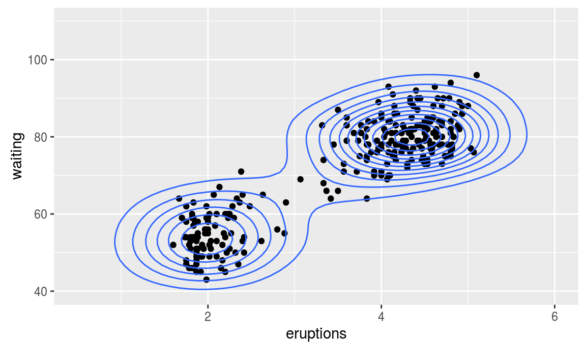
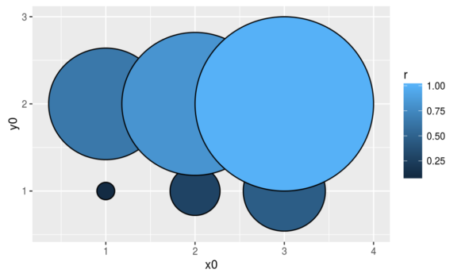

<!--html_preserve-->

 <!--page-body-->

 <!--container-fluid main-container-->

  

    

      

        
&nbsp;

        <h4>A List of gglot2 extensions</h4>
        <ul>
          <li>This site tracks and lists <strong>gglot2</strong> extenstions developed by R users in the community.</li>
          <li>The aim is to make it easy for R users to find developed extensions.</li>
        </ul>
      

      

        

          <!-- Indicators -->
          <ol class="carousel-indicators hide">
            <li data-target="#widget-carousel" data-slide-to="0" class="active"></li>
            <li data-target="#widget-carousel" data-slide-to="1"></li>
          </ol>

          <!-- Wrapper for slides -->
          

            

              
              

              

            

            

              
              

              

            

          

          <!-- Controls -->
          <!--
          <a class="left carousel-control" href="#widget-carousel" role="button" data-slide="prev">
            
            Previous
          </a>
          <a class="right carousel-control" href="#widget-carousel" role="button" data-slide="next">
            
            Next
          </a>
          -->
        

        <ul class="pagination pagination-sm">
          <li class="active"><a href="javascript:void" data-target="#widget-carousel" data-slide-to="0">&#x25bc;New Geoms</a></li>
          <li><a href="javascript:void" data-target="#widget-carousel" data-slide-to="1">&#x25bc;New Stats</a></li>

      

    
 <!-- row -->
  
 <!-- container-fluid main-container -->

 <!-- jumbotron -->

  <h3>See the Extensions</h3>
  

    

      

        

          
        

        

          
        

        

          
        

        

          
        

      

    

  

  

    

      
Go to the <a href="ggiraph.html">Extensions</a> page to see a list of ggplot2 extensions.

    

    

      
<a class="btn btn-primary" href="ggiraph.html" role="button">See the Extensions &raquo;</a>

    

  

  

  <h3>Submit your extension</h3>
  

    

      
Submit your ggplot2 extension so that other R users can easily find. Do so by just filing an issue on github or creating a pull request.

    

    

      
<a class="btn btn-primary" href="https://github.com/ggplot2-exts/ggplot2-exts.github.io/tree/dev" target="_blank" role="button">Submit your Extension &raquo;</a>

    

  

<!--/html_preserve-->
